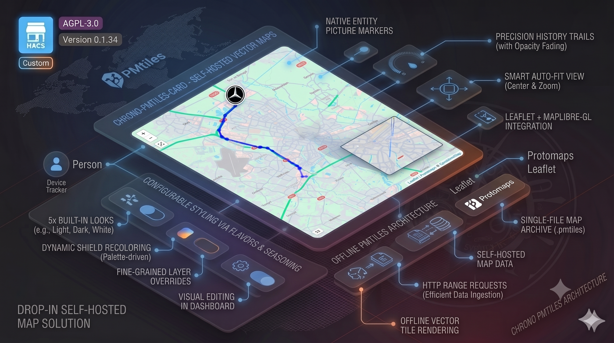

  
 <div align="center">

  [](https://github.com/hacs/integration)
  [](https://www.gnu.org/licenses/agpl-3.0)
  [](https://github.com/rob-vandenberg/chrono-pmtiles-card/releases)

  


  

  <p align="center">
    <strong>A fast, self-hosted vector map card for Home Assistant dashboards.<br>
            Your own map data, your own map style,<br>
            with live entity tracking and history trails.</strong>
  </p>

  <p align="center">
    <a href="#introduction">Introduction</a> •
    <a href="#key-features">Key Features</a> •
    <a href="#installation">Installation</a> •
    <a href="#getting-a-map-file">Map File</a> •
    <a href="#configuration">Configuration</a> •
    <a href="#license">License</a>
  </p>

</div>

---

**Chrono PMTiles Card** is a map card for Home Assistant that draws its map from a single `.pmtiles` file hosted on your own Home Assistant server. No map provider account, no API key, no tile server to run. You pick the region, you pick how it looks, and the card does the rest.

It shows your entity and device trackers as round markers with their picture, draws their history as a fading trail (just like HA's own map card), and zooms and centers itself around them automatically. The map itself is a crisp vector map, rendered by MapLibre, and can be restyled down to the color of a single road type.

---

## 📋 Table of Contents

- [Introduction](#introduction)
- [Key Features](#key-features)
- [Installation](#installation)
  - [HACS (Recommended)](#hacs-recommended)
  - [Manual Installation](#manual-installation)
- [Uninstallation](#uninstallation)
- [Getting a Map File](#getting-a-map-file)
- [Configuration](#configuration)
  - [Card Options](#card-options)
  - [Entity Options](#entity-options)
  - [How Centering and Zooming Work](#how-centering-and-zooming-work)
  - [Example YAML](#example-yaml)
- [Credits](#credits)
- [License](#license)
- [Support](#support)

---

## 🚀 Key Features

### 🗺️ Self-Hosted Vector Maps
The map comes from one `.pmtiles` file that sits in your Home Assistant `www` folder. The card reads only the small pieces it needs, straight from that file. No tile server, no map provider, no API key, no usage limits.

### 🎨 Fully Restylable
Start from one of five built-in looks (`light`, `dark`, `white`, `grayscale`, `black`) and change anything you like: the color of water, parks, buildings, every road type, labels, borders, even the road number shields. Want your map to look like that old road atlas in your glovebox? You can.

### 👤 Live Entity Tracking
Add your `person` or `device_tracker` entities and they show up as round markers with their entity picture (or their initials if there is no picture). Markers move live as positions change, without flickering.

### 🕒 History Trails
Set `hours_to_show` and each entity gets a trail of where it has been, fading from faint (oldest) to solid (newest), exactly like Home Assistant's own map card. Hover over a trail point to see who was there and when.

### 🎯 Smart Centering and Zooming
By default the card fits all your entities on the map. You can also center on a fixed spot, or on one of your entities (even one that is not shown on the map), and let the card work out the zoom. Or just set the zoom yourself. A reset button brings you back to that view at any time.

### 🎭 Fits Your Dashboard
The card follows your HA theme for its background, border and corners, and fills whatever width the dashboard gives it.

---

## 📦 Installation

### HACS (Recommended)

1. Open **HACS** in your Home Assistant instance.
2. Navigate to **Frontend** and click the three-dot menu in the top right corner.
3. Select **Custom repositories**.
4. Enter `https://github.com/rob-vandenberg/chrono-pmtiles-card` and select **Lovelace** as the category.
5. Click **Add**. The repository will appear in the list.
6. Search for `Chrono PMTiles Card` and click **Download**.
7. Reload your browser.

### Manual Installation

1. Download `chrono-pmtiles-card.js` from the [latest release](https://github.com/rob-vandenberg/chrono-pmtiles-card/releases/latest).
2. Copy it to your Home Assistant `config/www/` folder.
3. In Home Assistant, go to **Settings → Dashboards → Resources**.
4. Click **Add Resource**.
5. Enter `/local/chrono-pmtiles-card.js` as the URL and select **JavaScript Module**.
6. Click **Create** and reload your browser.

> **Don't forget the map file!** The card needs a `.pmtiles` map file to show anything. See [Getting a Map File](#getting-a-map-file) below.

---

## 🗑️ Uninstallation

### Via HACS
1. Open **HACS → Frontend**.
2. Find **Chrono PMTiles Card** and click the three-dot menu.
3. Select **Remove**.
4. Reload your browser.

### Manual
1. Delete `chrono-pmtiles-card.js` from `config/www/`.
2. Remove the resource entry from **Settings → Dashboards → Resources**.

### Map Files
Map files can be big, so don't forget to delete your `.pmtiles` file(s) from `config/www/` as well if you no longer need them.

---

## 🗺️ Getting a Map File

The card draws its map from a `.pmtiles` file in the [Protomaps basemap](https://docs.protomaps.com/basemaps/downloads) format. Protomaps publishes a fresh build of the whole planet every day, and you can cut out just the region you want with the free `pmtiles` command line tool.

1. Download the `pmtiles` tool for your computer from the [go-pmtiles releases page](https://github.com/protomaps/go-pmtiles/releases).
2. Pick a recent build from [maps.protomaps.com/builds](https://maps.protomaps.com/builds). Builds are named by date, like `20260921.pmtiles`.
3. Work out the bounding box of your region (west, south, east, north, in degrees). For example, most of Western Europe is `-11.4,34.6,29.1,60.5`.
4. Run the extract:
   ```
   pmtiles extract https://build.protomaps.com/20260921.pmtiles my-map.pmtiles --bbox=-11.4,34.6,29.1,60.5 --minzoom=0 --maxzoom=14
   ```
   Only the data for your region is downloaded, not the whole planet.
5. Copy `my-map.pmtiles` to your Home Assistant `config/www/` folder.
6. Use `/local/my-map.pmtiles` as the `pmtiles_url` in the card.

**How big will it be?** That depends on the size of your region. A single country is a lot smaller than a continent: a Europe-sized extract at zoom 0–14 is around 26 GB, so check you have the disk space.

**Why `--minzoom=0`?** Always include the low zoom levels. Without them, your region has nothing to show when you zoom out.

---


---

## ⚙️ Configuration

The card is configured in YAML.

### Card Options

| Property | Type | Default | Description |
| :--- | :--- | :--- | :--- |
| `pmtiles_url` | string | **required** | Where your map file lives, e.g. `/local/my-map.pmtiles`. |
| `map_height` | string | `300px` | Height of the map. Any CSS value works, e.g. `500px` or `calc(100vh - 100px)`. |
| `flavor` | string | `light` | The base map style: `light`, `dark`, `white`, `grayscale` or `black`. |
| `seasoning` | object | – | Change individual map colors on top of the chosen `flavor`, e.g. `water: '#93C2DC'` or `highway: '#FFC638'`. Also accepts `shield_fill` and `shield_border` to recolor the road number shields. |
| `layers` | object | – | Fine-tune individual map layers by name (e.g. `roads_highway`, `roads_shields`). Per layer you can set `paint` and `layout` properties, like line widths or label sizes. |
| `show_zoom_level` | boolean | `false` | Show the current zoom level in the bottom left corner. Handy while you are tuning your map. |
| `entities` | list | `[]` | The entities to show on the map. Each entry is either just an entity id, or an object with extra options (see [Entity Options](#entity-options)). |
| `hours_to_show` | number | `0` | How many hours of history to draw as a trail. `0` = markers only, no trail. |
| `history_line_color` | string | entity `color` | Default trail color for all entities. |
| `history_line_width` | number | `3` | Default trail line width in px, for all entities. |
| `history_dot_radius` | number | `3` | Default size of the trail points in px, for all entities. |
| `auto_fit` | boolean | `true` | Let the card work out the center and/or zoom from your entities. See [How Centering and Zooming Work](#how-centering-and-zooming-work). |
| `center` | string or object | – | Where to center the map. Either an entity (`person.rob` or `entity: person.rob`) or fixed coordinates (`lat:` and `lon:`). The entity does not need to be in `entities`. |
| `initial_zoom_level` | number | – | A fixed starting zoom level. When set, the card never picks the zoom by itself. |
| `min_auto_fit_zoom` | number | `3` | The furthest out the card will zoom when fitting your entities. |
| `max_auto_fit_zoom` | number | `14` | The furthest in the card will zoom when fitting your entities. Stops the map from zooming all the way in when everyone is at home. |

### Entity Options

Each entry in the `entities` list can be a plain entity id:

```yaml
entities:
  - person.rob
```

or an object with its own settings, which override the card-wide ones:

| Property | Type | Default | Description |
| :--- | :--- | :--- | :--- |
| `entity` | string | **required** | The entity id, e.g. `person.rob` or `device_tracker.phone`. |
| `color` | string | – | Default color for this entity's trail, used when `history_line_color` is not set. |
| `history_line_color` | string | card setting | Trail color for this entity. |
| `history_line_width` | number | card setting | Trail line width in px for this entity. |
| `history_dot_radius` | number | card setting | Size of this entity's trail points in px. |

### How Centering and Zooming Work

Three settings work together: `center`, `initial_zoom_level` and `auto_fit`. The simple rule is: **what you set yourself always wins, and `auto_fit` fills in the rest.**

- **Center:** your `center` if you set one. Otherwise, with `auto_fit` on, the middle of your entities. Otherwise, your Home zone.
- **Zoom:** your `initial_zoom_level` if you set one. Otherwise, with `auto_fit` on, the zoom that fits all your entities (kept between `min_auto_fit_zoom` and `max_auto_fit_zoom`). Otherwise, zoom 11.

In practice:

| `auto_fit` | `center` | `initial_zoom_level` | What you get |
| :--- | :--- | :--- | :--- |
| on | – | – | Everyone fits on the map. |
| on | set | – | Your center stays in the middle, zoomed out just enough to fit everyone around it. |
| on | – | set | Centered between your entities, at your zoom. |
| on | set | set | Your center, at your zoom. |
| off | – | – | Your Home zone, at zoom 11. |
| off | set | – | Your center, at zoom 11. |
| off | either | set | Your center (or Home zone), at your zoom. |

The **reset focus** button (below the zoom buttons) brings the map back to this view, using everyone's *current* position.

### Example YAML

```yaml
type: custom:chrono-pmtiles-card
pmtiles_url: /local/my-map.pmtiles
map_height: 500px
flavor: light
show_zoom_level: true
center: zone.home
hours_to_show: 4
history_line_width: 6
history_dot_radius: 6
entities:
  - entity: person.rob
    color: orange
  - entity: person.esther
    color: purple
seasoning:
  water: '#93C2DC'
  highway: '#FFC638'
  shield_fill: '#FFFFFF'
  shield_border: '#D83030'
layers:
  roads_shields:
    layout:
      text-size: 12
      icon-size: 1.1
```

---

## 🙏 Credits

This card stands on the shoulders of some great open source projects:

- Map data © [OpenStreetMap](https://www.openstreetmap.org/copyright) contributors
- Map schema, styles, fonts and icons by [Protomaps](https://protomaps.com)
- Map rendering by [MapLibre GL JS](https://maplibre.org) and [Leaflet](https://leafletjs.com)
- [PMTiles](https://github.com/protomaps/PMTiles) for the single-file map format

---

## ⚖️ License

**GNU Affero General Public License v3.0 (AGPL-3.0)**

This project is licensed under the AGPL-3.0. You are free to use, modify, and distribute this software, provided that any modifications or derivative works that are made available — including over a network — are also distributed under the same license.

Full license text: [https://www.gnu.org/licenses/agpl-3.0](https://www.gnu.org/licenses/agpl-3.0)

Copyright © 2026 Rob Vandenberg. All rights reserved.

---

## ☕ Support

If you find this project useful and wish to support its continued development, please consider a contribution.

[](https://www.buymeacoffee.com/robvandenberg)
